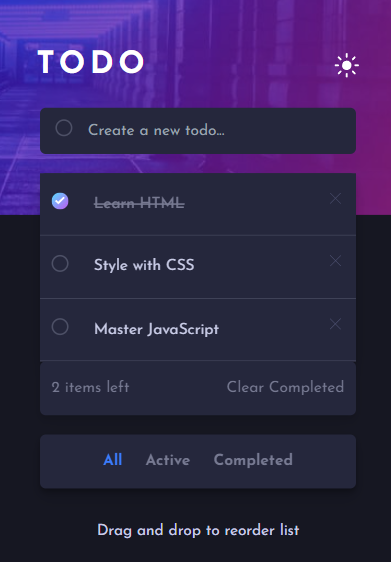
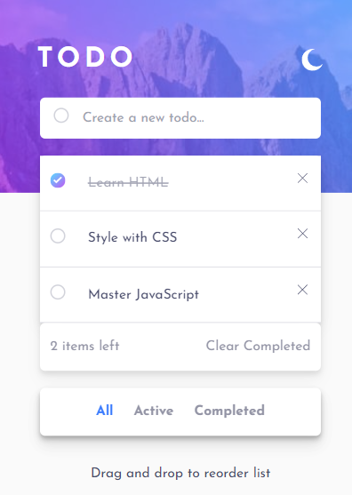

# Frontend Mentor - Todo app solution

This is a solution to the [Todo app challenge on Frontend Mentor](https://www.frontendmentor.io/challenges/todo-app-Su1_KokOW). Frontend Mentor challenges help you improve your coding skills by building realistic projects. 

## Table of contents

- [Overview](#overview)
  - [The challenge](#the-challenge)
  - [Screenshot](#screenshot)
  - [Links](#links)
- [My process](#my-process)
  - [Built with](#built-with)
  - [What I learned](#what-i-learned)
  - [Continued development](#continued-development)
  - [Useful resources](#useful-resources)
- [Author](#author)
- [Acknowledgments](#acknowledgments)

**Note: Delete this note and update the table of contents based on what sections you keep.**

## Overview

### The challenge

Users should be able to:

- View the optimal layout for the app depending on their device's screen size
- See hover states for all interactive elements on the page
- Add new todos to the list
- Mark todos as complete
- Delete todos from the list
- Filter by all/active/complete todos
- Clear all completed todos
- Toggle light and dark mode
- **Bonus**: Drag and drop to reorder items on the list

### Screenshot




### Links

- Solution URL: [Add solution URL here](https://your-solution-url.com)
- Live Site URL: [Add live site URL here](https://your-live-site-url.com)

## My process

### Built with

- Semantic HTML5 markup
- CSS custom properties
- Tailwind CSS
-JavaScript
- Mobile-first workflow


### What I learned


Building a Todo app with JavaScript is a great way to learn and practice various aspects of web development. This project provides a practial and tangible project for applying many concepts, making it an excellent learning experience for aspiring web developers.

 Here are some key concepts and skills you can learn while working on a Todo app:

1. **HTML and CSS:** You'll gain hands-on experience in structuring the HTML document and styling the app using CSS. This includes creating a clean and user-friendly interface.

2. **DOM Manipulation:** You'll use JavaScript to interact with the Document Object Model (DOM), dynamically updating the content of the page based on user actions.

3. **Event Handling:** Learn how to handle user interactions, such as button clicks or form submissions, by attaching event listeners to elements.

4. **Local Storage:** Implementing local storage allows you to persist data on the user's device. You'll learn how to store and retrieve data locally, enabling the app to remember tasks even after a page refresh.

5. **Arrays and Loops:** Manage the list of tasks using JavaScript arrays. You'll also use loops to iterate through the array elements and update the DOM accordingly.


6. **Conditional Statements:** Use conditional statements (if/else) to implement logic in your app. For example, you may want to check if a task is completed or not.

7. **Functions:** Organize your code by creating functions to handle specific tasks. Functions can be reused throughout your code, promoting code reusability.

8. **Responsive Design:** Implement responsive design principles to make your Todo app accessible and visually appealing on various devices and screen sizes.


9. **CSS Frameworks:** Optionally, you can explore using CSS frameworks (like Bootstrap or Tailwind CSS) to enhance the styling of your app.


10. **Multiple Challenges:** Frontend Mentor TODO app is full of challenges .

- Add ToDo List
- Theme-Switcher
- Drag and Drop

```html
<h1>Some HTML code I'm proud of</h1>
```
```css
.proud-of-this-css {
  color: papayawhip;
}
```
```js
const proudOfThisFunc = () => {
  console.log('🎉')
}
```


### Continued development

Want to continue mastering Javascript/

### Useful resources

- Javascripi-info

## Author

- Frontend Mentor - [@manjubhaskar02](https://www.frontendmentor.io/profile/manjubhaskar02)

## Acknowledgments

I  want to thank my partner, Safaldas who always spent his valuable time for teaching me the javascript concepts.
He explained each and every functions and also corrected the faults .

I am also thankful to chatGPT, many youtube videos and codepen references.
